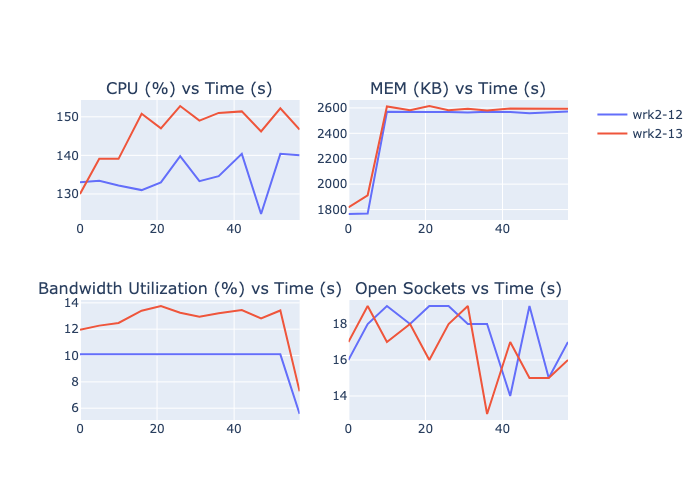
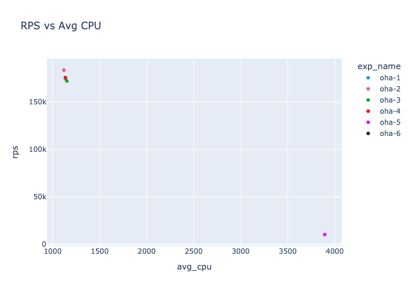
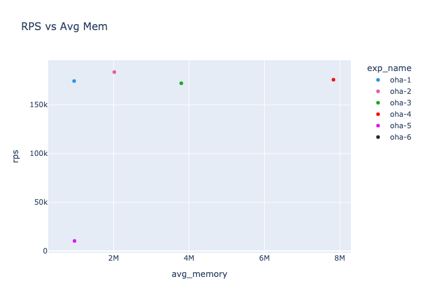
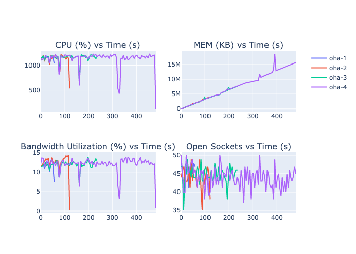
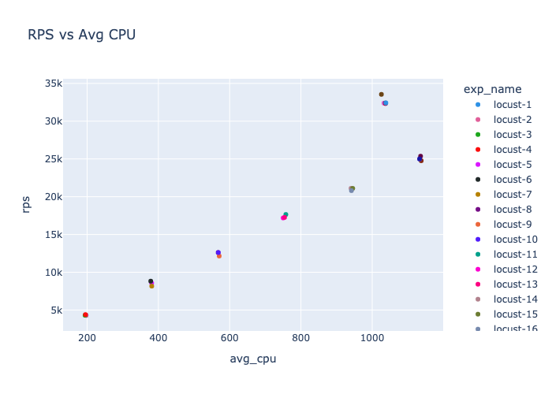
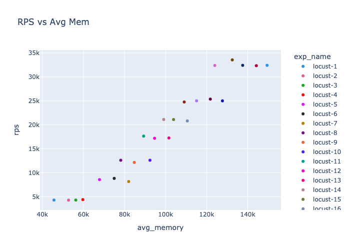
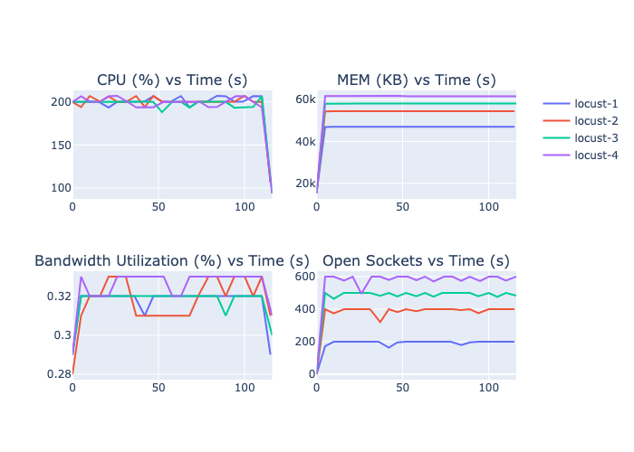
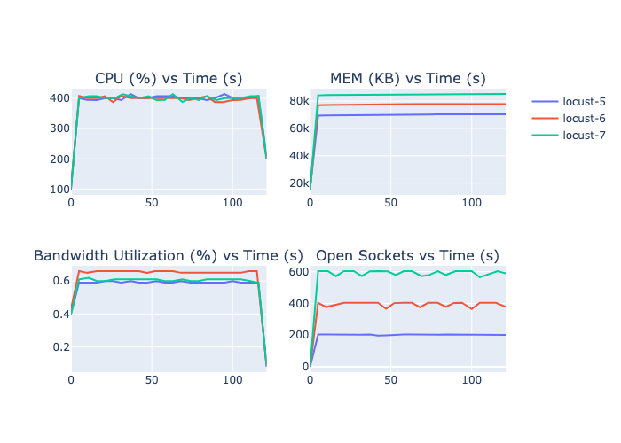

# A Qualitative and Quantitative Analysis of HTTP Benchmarking Tools

# Introduction

In this report we present a qualitative and quantitative analysis of HTTP benchmarking tools. We have selected the following tools for our analysis:

1. Wrk (https://github.com/wg/wrk)
2. Wrk2 (https://github.com/giltene/wrk2)
3. Oha (https://github.com/hatoo/oha)
4. Apache Benchmark (https://httpd.apache.org/docs/2.4/programs/ab.html)
5. Locust (https://locust.io/)
6. K6 (https://k6.io/)


# Experimental Setup

We have conducted a series of experiments on these tools using Cloudlab (https://cloudlab.us/). We have chosen the following experimental setup:

## Nodes

We have two nodes of type `c220g2` with the following specifications:

```
Type	c220g2
Class	pc
Architecture	x86_64
dom0mem	4096M
hw_cpu_bits	64
hw_cpu_cores	10
hw_cpu_hv	1
hw_cpu_sockets	2
hw_cpu_speed	2600
hw_cpu_threads	2
hw_mem_size	163840
processor	Haswell
?+disk_any	2217350
?+disk_nonsysvol	1144500
?+disk_sysvol	1072850
adminmfs_osid	FREEBSD-64-MFS-NEW
default_imageid	UBUNTU22-64-STD
default_osid	UBUNTU22-64-STD
delay_osid	FBSD-STD
diskloadmfs_osid	FRISBEE-64-MFS-NEW
jail_osid	FBSD-STD
recoverymfs_osid	RECOVERY-LINUX
```

One node is the loadgen node and the other is the server node. The loadgen node is used to run the benchmarking tools and the server node is used to run the web server.

The server node is running Nginx (https://www.nginx.com/) as the web server with default configuration. 

After every experiment, we reboot the server node to ensure that the server is in a clean state.

For every experiment, we measure the following metrics:

1. CPU Utilization (in %)
2. Memory Utilization (in KB)
3. Bandwidth Utilization (in KB/s)
4. Bandwidth Utilization (in %)
5. Open Sockets

# Background

HTTP benchmarking tools are used to measure the performance of web servers and applications by simulating a large number of concurrent users making requests to the server. These tools are commonly used to test the scalability and reliability of web applications under different load conditions. They can help identify performance bottlenecks, optimize resource usage, and improve the overall user experience. Each tool has its own strengths and weaknesses, and is suited for different types of testing scenarios. In this report, we will compare the features, capabilities, and performance of the selected tools. 

Through our experiments we have observed the following configurations affect the performance of the tools, we will use these configurations to present a quantitative analysis of the tools:

1. **Number of connections**: The number of concurrent connections that the tool will make to the server. This can range from a few connections to thousands of connections. Each tool has its own way of specifying the number of connections. Each connection defines a single user session. 

2. **Duration**: The duration for which the tool will run the benchmark. This can range from a few seconds to several hours. 

3. **Keep-alive**: Whether the tool will reuse the same connection for multiple requests or open a new connection for each request. 

4. **Request Rate**: The rate at which the tool should send requests to the server. This can be specified in requests per second (RPS) or requests per minute (RPM). Some tools allow you to configure this parameter, whereas others do not.

5. **Multi-threading/Multi-processing**: Whether the tool uses multiple threads or processes to send requests to the server. 

Here's is a list showing each evaluated tool and the configurations it supports:

| Tool              | Number of Connections | Duration | Disable Keep-alive | Request Rate | Multi-threading/Multi-processing |
|-------------------|-----------------------|----------|--------------------|--------------|----------------------------------|
| Wrk               | Yes                   | Yes      | No                 | No           | Yes (Multi-Threading)            |
| Wrk2              | Yes                   | Yes      | No                 | Yes          | Yes (Multi-Threading)            |
| Oha               | Yes                   | Yes      | Yes                | Yes          | Yes (Multi-Threading)            |
| Apache Benchmark  | Yes                   | Yes      | No                 | Yes          | No                               |
| Locust            | Yes                   | Yes      | No                | Yes          | Yes (Multi-Processing)           |
| K6                | Yes                   | Yes      | Yes                | Yes          | Yes (Multi-Threading)            |


# Tools Overview

## Wrk

Wrk is a benchmarking tool written in C that is designed for testing HTTP servers. 

Here are some of the key features of Wrk:
1. **Supports Multi-Threading**: Wrk uses multiple threads to manage connections and send requests to the server. This allows it to simulate a large number of concurrent users.
2. **Connections Keep-alive**: Wrk only supports keep-alive connections, which means that it reuses the same connection for multiple requests.
3. **Lua Scripting**: Wrk allows you to write Lua scripts to customize the request generation process. This can be useful for testing complex scenarios.
4. **Metrics**: Wrk provides the following metrics for each benchmark: 
    - **Thread Metrics**:
        - Latency: Average, Stdev, Max, +/- Stdev
        - Req/Sec: Average, Stdev, Max, +/- Stdev
    - **Latency Distribution**:
        - 50%
        - 75%
        - 90%
        - 99%
    - **Number of requests**: Total
    - **Requests/sec**: Total number of requests / duration
    - **Transfer/sec**: Total number of bytes transferred / duration
5. **Configuration**: Wrk allows configuring the following parameters:
    - **Number of connections**: The total number of connections which will be distributed among threads.
    - **Duration**: The duration for which the benchmark will run.
    - **Number of threads**: The number of threads that will be used to send requests.
    - **Script**: The Lua script that will be used to generate requests.
    - **Timeout**: The timeout for each request.
    - **Headers**: The headers that will be sent with each request.

Here is a sample output of running wrk:
```
Running 1m test @ http://192.168.1.2/
  1 threads and 10 connections
  Thread Stats   Avg      Stdev     Max   +/- Stdev
    Latency   101.68us   25.37us   5.50ms   86.67%
    Req/Sec    94.44k     6.66k  102.67k    91.18%
  Latency Distribution
     50%   96.00us
     75%  109.00us
     90%  128.00us
     99%  190.00us
  5646128 requests in 1.00m, 4.52GB read
Requests/sec:  93945.84
Transfer/sec:     76.96MB
```

Here are the details of the configurations we used to evaluate Wrk: 

|exp_name|threads|connections|duration|rps|avg_cpu                           |avg_memory                    |avg_bandwidth|avg_bandwidth_utilization|avg_open_sockets  |
|--------|-------|-----------|--------|---|----------------------------------|------------------------------|-------------|-------------------------|------------------|
|wrk-1   |1      |10         |60      |93945.84|75.15                             |1652.0833333333333            |91397.05833333333|7.140000000000001        |7.5               |
|wrk-2   |1      |10         |120     |93070.32|76.20416666666667                 |1735.5                        |90296.0025   |7.054583333333333        |8.416666666666666 |
|wrk-3   |5      |10         |120     |85145.22|207.61666666666667                |1818.1666666666667            |82574.47833333333|6.452083333333333        |8.375             |
|wrk-4   |5      |100        |120     |175737.13|287.8333333333333                 |2395.4583333333335            |170420.81666666668|13.314583333333331       |95.41666666666667 |
|wrk-5   |5      |1000       |120     |178971.44|300.2916666666667                 |7538.541666666667             |173550.69166666668|13.558333333333332       |968.6666666666666 |
|wrk-6   |10     |1000       |480     |179004.74|487.8709677419355                 |8349.913978494624             |178944.09354838709|13.980645161290319       |982.7096774193549 |
|wrk-7   |20     |1000       |480     |178694.46|637.4967741935484                 |9743.52688172043              |178613.7752688172|13.954516129032255       |982.8602150537635 |
|wrk-8   |30     |1000       |480     |178076.82|675.7548387096774                 |11383.709677419354            |177931.23978494626|13.900860215053765       |972.7311827956989 |
|wrk-9   |30     |1000       |600     |179698.59|634.1060344827587                 |11385.637931034482            |180018.06293103448|14.063793103448276       |974.8275862068965 |
|wrk-10  |10     |600        |600     |180192.37|487.9853448275863                 |5964.6551724137935            |180561.28275862068|14.106724137931035       |588.7413793103449 |

Here are some graphs that show the performance of wrk against the different configurations: 

**RPS vs Average CPU Utilization**


**RPS vs Average Memory Utilization**


*Analysis*: 

Wrk-1 experiment runs wrk as as a single thread with 10 connections for 60 seconds. The average CPU utilization is only 75% giving an RPS of about 93k. Wrk-2 is the similar configuration running for 120 seconds - the RPS and memory in this case is not affected. Similarly, Wrk-8 and Wrk-9 have similar RPS and memory utilizations. 


The bandwidth utilization is almost consistent throughout the duration of the experiment. This can be attributed to the fact that wrk keeps the connections alive and reuses them for multiple requests. The number of open sockets fluctuates between 5 and 10. 

The experiments wrk-3, wrk-4, and wrk-5 show the results of increasing the number of connections to 10, 100, and 1000 while keeping the number of threads constant at 5. 


Thought the number of connections differ by a factor of 10 between wrk-4 and wrk-5, they both have similar RPS, CPU, and Bandwidth Utilization. The Memory Utilization and Open Sockets are higher in wrk-5 because of the increased number of connections. 

The experiments wrk-6, wrk-7, and wrk-8 show the results of increasing the number of threads to 10, 20, and 30 while keeping the number of connections constant at 1000 and the duration at 480 seconds. 


We were able to get the best RPS in experiment wrk-10 with 180k RPS.


## Wrk2

Wrk2 is a fork of the original Wrk tool with some additional features. It also allows keeping the request rate constant throughout the benchmark. It uses HDRHistogram to measure latency and provides more detailed metrics compared to Wrk. 

Here are some of the key features of Wrk2:

1. **Supports Multi-Threading**: Like Wrk, Wrk2 uses multiple threads to manage connections and send requests to the server. This allows it to simulate a large number of concurrent users.

2. **Connections Keep-Alive**: Wrk2 supports only keep-alive connections, which means that it reuses the same connection for multiple requests.

3. **Lua Scripting**: Wrk2 allows you to write Lua scripts to customize the request generation process. This can be useful for testing complex scenarios.

4. **Metrics**: Wrk2 provides the following metrics for each benchmark: 
    - **Thread Metrics**:
        - Latency: Average, Stdev, Max, +/- Stdev
        - Req/Sec: Average, Stdev, Max, +/- Stdev
    - **Latency Distribution**:
        -  50%
        -  75%
        -  90%
        -  99%
        -  99.9%
        -  99.99%
        -  99.999%
        -  100%
    - **Number of requests**: Total
    - **Requests/sec**: Total number of requests / duration
    - **Transfer/sec**: Total number of bytes transferred / duration

Here is a sample output of running wrk2:

```
Running 1m test @ http://192.168.1.2
  1 threads and 10 connections
  Thread calibration: mean lat.: 1.089ms, rate sampling interval: 10ms
  Thread Stats   Avg      Stdev     Max   +/- Stdev
    Latency     1.14ms  355.73us   2.54ms   69.45%
    Req/Sec     2.11k   181.65     3.22k    86.58%
  Latency Distribution (HdrHistogram - Recorded Latency)
 50.000%    1.11ms
 75.000%    1.35ms
 90.000%    1.61ms
 99.000%    2.14ms
 99.900%    2.34ms
 99.990%    2.46ms
 99.999%    2.50ms
100.000%    2.54ms

  Detailed Percentile spectrum:
       Value   Percentile   TotalCount 1/(1-Percentile)

       0.212     0.000000            1         1.00
       0.703     0.100000         9997         1.11
       0.830     0.200000        20070         1.25
       ....
       2.541     0.999991        99900    109226.67
       2.541     1.000000        99900          inf
#[Mean    =        1.138, StdDeviation   =        0.356]
#[Max     =        2.540, Total count    =        99900]
#[Buckets =           27, SubBuckets     =         2048]
----------------------------------------------------------       
  119956 requests in 1.00m, 98.26MB read
Requests/sec:   1999.21
Transfer/sec:      1.64MB
```

Here are the details of the configurations we used to evaluate Wrk2:

|exp_name|threads|connections|duration|rate|rps                               |avg_cpu                       |avg_memory|avg_bandwidth     |avg_bandwidth_utilization|avg_open_sockets  |
|--------|-------|-----------|--------|----|----------------------------------|------------------------------|----------|------------------|-------------------------|------------------|
|wrk2-1  |1      |10         |60      |2000|1999.21                           |6.433333333333334             |1930.25   |1939.4316666666666|0.15333333333333332      |10.0              |
|wrk2-2  |1      |10         |60      |3000|2998.86                           |11.375                        |1881.1666666666667|2909.0483333333327|0.23083333333333336      |9.916666666666666 |
|wrk2-3  |1      |10         |60      |4000|3998.45                           |12.975000000000001            |1871.5833333333333|3878.6175000000003|0.30749999999999994      |9.916666666666666 |
|wrk2-4  |1      |10         |60      |8000|7996.72                           |20.34166666666667             |1920.9166666666667|7757.3949999999995|0.6058333333333333       |9.833333333333334 |
|wrk2-5  |1      |10         |60      |16000|15993.64                          |34.53333333333333             |1792.0    |15510.209166666667|1.2108333333333332       |9.583333333333334 |
|wrk2-6  |1      |10         |60      |32000|31987.6                           |66.14999999999999             |1871.25   |31041.350000000002|2.424166666666667        |9.333333333333334 |
|wrk2-7  |1      |10         |60      |64000|63976.24                          |67.44166666666666             |1952.3333333333333|62128.475         |4.851666666666667        |8.5               |
|wrk2-8  |1      |10         |60      |128000|91295.02                          |75.64166666666668             |1932.0833333333333|88854.15000000001 |6.941666666666667        |8.333333333333334 |
|wrk2-9  |1      |20         |60      |128000|98082.94                          |81.45833333333333             |1833.5833333333333|95277.74166666665 |7.4425                   |17.666666666666668|
|wrk2-10 |1      |10         |120     |128000|90901.71                          |75.77916666666665             |1964.25   |87985.49625000001 |6.874583333333334        |7.916666666666667 |
|wrk2-11 |2      |10         |60      |128000|90832.87                          |129.375                       |2265.75   |88177.79999999999 |6.887499999999999        |7.75              |
|wrk2-12 |2      |20         |60      |128000|127950.79                         |134.65833333333333            |2433.8333333333335|124272.64166666666|9.71                     |17.5              |
|wrk2-13 |2      |20         |60      |256000|164938.28                         |146.275                       |2472.25   |160238.71666666667|12.519166666666665       |16.666666666666668|
|wrk2-14 |2      |40         |60      |256000|187280.11                         |143.29166666666666            |2491.75   |182038.5          |14.222500000000002       |34.666666666666664|
|wrk2-15 |4      |80         |60      |256000|177447.91                         |248.40833333333333            |3546.25   |172238.55833333332|13.45583333333333        |73.5              |
|wrk2-16 |8      |100        |60      |256000|176805.78                         |402.4583333333333             |5882.166666666667|171521.70833333334|13.400833333333333       |90.66666666666667 |
|wrk2-17 |8      |100        |120     |256000|176131.33                         |405.0083333333334             |6071.375  |170635.12708333333|13.330416666666666       |90.91666666666667 |
|wrk2-18 |10     |200        |120     |256000|179923.46                         |469.4958333333334             |7466.625  |174231.47458333333|13.61166666666667        |190.08333333333334|
|wrk2-19 |10     |600        |120     |256000|179190.44                         |473.8958333333333             |9847.041666666666|173477.86666666667|13.553333333333333       |570.4166666666666 |
|wrk2-20 |20     |1000       |600     |256000|179066.39                         |643.8965517241379             |18646.422413793105|179301.41293103446|14.008189655172414       |980.7931034482758 |


Here are some graphs that show the performance of wrk2 against the different configurations:

**RPS vs Average CPU Utilization**


**RPS vs Average Memory Utilization**


*Analysis*:

The experiments from wrk2-1 to wrk2-4 show the results of increasing the request rate from 2000 to 8000 while keeping the number of threads and connections constant at 1 and 10 respectively. The RPS increases linearly with the request rate, and the CPU utilization also increases with the request rate. The memory utilization remains behaves similarly across all experiments.


The experiments wrk2-5 to wrk2-8 show the results of increasing the request rate from 16000 to 128000 while keeping the number of threads and connections constant at 1 and 10 respectively. The RPS increases linearly with the request rate, and the CPU utilization also increases with the request rate. The memory utilization remains behaves similarly across all experiments.


From these experiments, we can see that a single thread can achieve a maximum RPS of 91k. 

A comparison between `wrk2-8` and `wrk2-9` shows that increasing the number of connections from 10 to 20 only increases the RPS by 7k. 


Another comparison between `wrk2-8` and `wrk2-11` shows that increasing the number of threads from 1 to 2 while keeping the number of connections, duration, and request rate constant at 10, 60, and 128000 respectively, increases the RPS by only 1k. The CPU utilization increases, as expected, but the memory utilization also increases for managing the same number of connections.


We compare experiments `wrk2-12` and `wrk2-13` where the target rate is increased from 128k to 256k. The RPS increases by 37k, and the CPU utilization increases slightly. 



The comparison between `wrk2-13` and `wrk2-14` shows that increasing the number of connections from 20 to 40 increases the RPS by 22k with only a slight increase in the CPU Utilization. 


The experiments from `wrk2-15` to `wrk2-20` show that there is no significant increase in the RPS when the number of threads and connections are increased. 

## Oha

Oha is a HTTP Benchmarking tool written in Rust. It is designed to be simple and easy to use.

Here are some of the key features of Oha:

1. **Supports Multi-Threading**: Oha uses multiple threads to manage connections and send requests to the server. This allows it to simulate a large number of concurrent users.

2. **Connections Keep-Alive**: Oha supports both keep-alive and non-keep-alive connections.

3. **Latency Correction**: This feature allows Oha to avoid coordinated omission problem and provide more accurate latency measurements.

4. **Burst Requests**: Oha allows specifying the number of requests to send in a burst.

5. **HTTP/2 Support**: Oha supports HTTP/2 protocol.

6. **Metrics**: Oha provides the following metrics for each benchmark: 
    - **Success Rate**: The percentage of successful requests.
    - **Request Statistics**:
        - Slowest Request Time
        - Fastest Request Time
        - Average Request Time
    - **Response Time Histogram**
    - **Response Time Distribution**
    - **Error Distribution**

Here is a sample output of running oha:

```
Summary:
  Success rate: 100.00%
  Total:        60.0917 secs
  Slowest:      49.7170 secs
  Fastest:      0.0016 secs
  Average:      25.4562 secs
  Requests/sec: 168592.5052

  Total data:   3.62 GiB
  Size/request: 384 B
  Size/sec:     61.74 MiB

Response time histogram:
   0.002 [1]       |
   4.973 [969652]  |■■■■■■■■■■■■■■■■■■■■■■■■■■
   9.945 [962422]  |■■■■■■■■■■■■■■■■■■■■■■■■■■
  14.916 [999910]  |■■■■■■■■■■■■■■■■■■■■■■■■■■■
  19.888 [936175]  |■■■■■■■■■■■■■■■■■■■■■■■■■
  24.859 [1076384] |■■■■■■■■■■■■■■■■■■■■■■■■■■■■■
  29.831 [1001081] |■■■■■■■■■■■■■■■■■■■■■■■■■■■
  34.802 [928429]  |■■■■■■■■■■■■■■■■■■■■■■■■■
  39.774 [1021459] |■■■■■■■■■■■■■■■■■■■■■■■■■■■■
  44.745 [1069723] |■■■■■■■■■■■■■■■■■■■■■■■■■■■■■
  49.717 [1165771] |■■■■■■■■■■■■■■■■■■■■■■■■■■■■■■■■

Response time distribution:
  10.00% in 5.1734 secs
  25.00% in 12.8476 secs
  50.00% in 25.3718 secs
  75.00% in 38.2460 secs
  90.00% in 45.3449 secs
  95.00% in 47.5622 secs
  99.00% in 49.4089 secs
  99.90% in 49.6738 secs
  99.99% in 49.7126 secs


Details (average, fastest, slowest):
  DNS+dialup:   0.0002 secs, 0.0001 secs, 0.0035 secs
  DNS-lookup:   0.0000 secs, 0.0000 secs, 0.0003 secs

Status code distribution:
  [200] 10131007 responses

Error distribution:
  [5] aborted due to deadline
```

Here are the details of the configurations we used to evaluate Oha:

|exp_name|duration|qps|disable_keepalive|rps|avg_cpu                           |avg_memory                    |avg_bandwidth|avg_bandwidth_utilization|avg_open_sockets  |
|--------|--------|---|-----------------|---|----------------------------------|------------------------------|-------------|-------------------------|------------------|
|oha-1   |60      |1000000|False            |174445.1054|1136.25                           |952788.0                      |149359.83333333334|11.668333333333331       |46.083333333333336|
|oha-2   |120     |1000000|False            |183634.582|1119.3                            |2019393.8333333333            |157456.67875 |12.300416666666669       |43.875            |
|oha-3   |240     |1000000|False            |172160.6277|1150.9847826086957                |3795004.9565217393            |153254.0     |11.973043478260871       |44.82608695652174 |
|oha-4   |480     |1000000|False            |175808.524|1135.7247311827957                |7831355.655913979             |155090.13268817205|12.11677419354839        |43.89247311827957 |
|oha-5   |120     |1000000|True             |10298.1215|3894.217391304348                 |963064.3478260869             |11367.91304347826|0.8891304347826086       |6.695652173913044 |
|oha-6   |480     |1000000|True             |   |3846.470588235294                 |726881.8823529412             |12916.805882352943|1.0094117647058825       |5.705882352941177 |

Here are some graphs that show the performance of oha against the different configurations:





The experiments from `oha-1` to `oha-4` show the results of increasing the duration from 60 to 480 while keeping the qps constant at 1M, with the connections being kept alive. We don't see a significant increase in the RPS with the increase in the duration. 



The graphs show that the CPU utilization is consistent across all experiments, the memory utilization increases with the duration of the experiment. The bandwidth utilization is also similar. The number of open sockets, however, oscillate between 35 and 50. 


## Locust

Locust is an open-source load testing tool written in Python. It allows you to define user behavior with Python code and simulate a large number of concurrent users making requests to the server. We use the FastHttpUser class in Locust which an upgraded version of the HttpUser class. 

Here are some of the key features of Locust:

1. **Supports Multi-Processing**: Locust can run in distributed mode as different processes on the same machine or on different machines. This allows it to simulate a large number of concurrent users. We, however, tested Locust in multi-processing mode on a single machine.

2. **Connections Keep-Alive**: Locust reuses the same connection for multiple requests. It does not support non-keep-alive connections.

3. **Web Interface**: Locust provides a web interface that allows you to monitor the progress of the test in real-time. You can see the number of users, the number of requests, the response time, and other metrics.

4. **Metrics**: Locust provides the following metrics for each benchmark:
    - Requests
      - Number of requests
      - Number of failures
      - Requests per second
      - Failures per second
    - Response Time Percentiles
      - 50%
      - 66%
      - 75%
      - 80%
      - 90%
      - 95%
      - 98%
      - 99%
      - 99.9%
      - 99.99%
      - 100%

5. **Configuration**: Locust allows configuring the following parameters:
    - **Number of users**: The number of concurrent users that will be simulated.
    - **Hatch Rate**: The rate at which users will be spawned.
    - **Stop on failure**: Whether the test should stop if a failure occurs.
    - **Run time**: The duration for which the test will run.


Here is a sample output of running Locust:

```
[2024-11-02 23:39:09,700] load-gen/INFO/locust.main: Starting Locust 2.32.1
[2024-11-02 23:39:09,700] load-gen/INFO/locust.main: Run time limit set to 120 seconds
[2024-11-02 23:39:09,701] load-gen/WARNING/locust.runners: Your selected spawn rate is very high (>100), and this is known to sometimes cause issues. Do you really need to ramp up that fast?
[2024-11-02 23:39:09,701] load-gen/INFO/locust.runners: Ramping to 200 users at a rate of 200.00 per second
[2024-11-02 23:39:09,718] load-gen/INFO/locust.runners: All users spawned: {"MyUser": 200} (200 total users)
[2024-11-02 23:39:14,706] load-gen/WARNING/root: CPU usage above 90%! This may constrain your throughput and may even give inconsistent response time measurements! See https://docs.locust.io/en/stable/running-distributed.html for how to distribute the load over multiple CPU cores or machines
[2024-11-02 23:41:09,462] load-gen/INFO/locust.main: --run-time limit reached, shutting down
[2024-11-02 23:41:09,543] load-gen/WARNING/locust.runners: CPU usage was too high at some point during the test! See https://docs.locust.io/en/stable/running-distributed.html for how to distribute the load over multiple CPU cores or machines
[2024-11-02 23:41:09,543] load-gen/INFO/locust.main: Shutting down (exit code 0)
Type     Name                                                                          # reqs      # fails |    Avg     Min     Max    Med |   req/s  failures/s
--------|----------------------------------------------------------------------------|-------|-------------|-------|-------|-------|-------|--------|-----------
GET      /                                                                             515233     0(0.00%) |      6       0     343      6 | 4299.36        0.00
--------|----------------------------------------------------------------------------|-------|-------------|-------|-------|-------|-------|--------|-----------
         Aggregated                                                                    515233     0(0.00%) |      6       0     343      6 | 4299.36        0.00

Response time percentiles (approximated)
Type     Name                                                                                  50%    66%    75%    80%    90%    95%    98%    99%  99.9% 99.99%   100% # reqs
--------|--------------------------------------------------------------------------------|--------|------|------|------|------|------|------|------|------|------|------|------
GET      /                                                                                       6      8      9     10     11     16     17     50     69    180    340 515233
--------|--------------------------------------------------------------------------------|--------|------|------|------|------|------|------|------|------|------|------|------
         Aggregated                                                                              6      8      9     10     11     16     17     50     69    180    340 515233

```


Here are the details of the configurations we used to evaluate Locust:

|exp_name|users |spawn_rate|processes|run_time|rps                               |avg_cpu                       |avg_memory|avg_bandwidth     |avg_bandwidth_utilization|avg_open_sockets  |
|--------|------|----------|---------|--------|----------------------------------|------------------------------|----------|------------------|-------------------------|------------------|
|locust-1|200   |200       |1        |120     |4299.36                           |197.28260869565213            |45615.52173913043|4046.588695652173 |0.3169565217391305       |187.2608695652174 |
|locust-2|400   |400       |1        |120     |4289.87                           |197.0173913043478             |52731.34782608696|4045.4634782608696|0.31782608695652176      |375.39130434782606|
|locust-3|500   |500       |1        |120     |4306.21                           |194.17391304347825            |56253.86956521739|4058.4491304347825|0.31739130434782614      |470.39130434782606|
|locust-4|600   |600       |1        |120     |4395.51                           |195.3043478260869             |59678.086956521736|4143.336956521739 |0.32521739130434785      |561.7391304347826 |
|locust-5|200   |200       |2        |120     |8566.03                           |381.0625                      |67814.45833333333|7221.317916666667 |0.5633333333333334       |194.58333333333334|
|locust-6|400   |400       |2        |120     |8823.07                           |378.5541666666666             |74973.41666666667|7963.5529166666665|0.6225                   |379.0             |
|locust-7|600   |600       |2        |120     |8164.12                           |381.36666666666673            |82022.125 |7375.772083333333 |0.5762499999999999       |568.7083333333334 |
|locust-8|200   |200       |3        |120     |12611.62                          |567.65                        |78161.25  |10622.246249999998|0.8308333333333332       |194.58333333333334|
|locust-9|400   |400       |3        |120     |12149.39                          |570.625                       |84760.75  |10313.178333333333|0.80625                  |382.7083333333333 |
|locust-10|600   |600       |3        |120     |12609.18                          |568.2166666666667             |92367.95833333333|11380.270416666666|0.89                     |570.4583333333334 |
|locust-11|200   |200       |4        |120     |17645.71                          |757.6583333333333             |89300.45833333333|14856.464999999998|1.16                     |196.79166666666666|
|locust-12|400   |400       |4        |120     |17192.38                          |750.1416666666668             |94629.625 |14483.482916666666|1.1316666666666666       |383.3333333333333 |
|locust-13|600   |600       |4        |120     |17263.57                          |754.0875000000001             |101597.875|14644.080000000002|1.1445833333333333       |574.3333333333334 |
|locust-14|200   |200       |5        |120     |21111.22                          |940.6750000000001             |99077.375 |17770.38625       |1.3879166666666667       |195.625           |
|locust-15|400   |400       |5        |120     |21104.13                          |945.2708333333334             |103869.29166666667|17774.067916666667|1.3895833333333332       |386.9583333333333 |
|locust-16|600   |600       |5        |120     |20805.6                           |941.75                        |110574.75 |17582.132500000003|1.374583333333333        |575.0416666666666 |
|locust-17|200   |200       |6        |120     |24764.56                          |1137.5291666666667            |109067.125|20842.30916666667 |1.6287500000000001       |200.0             |
|locust-18|400   |400       |6        |120     |25005.18                          |1132.8208333333334            |115080.83333333333|21047.178333333333|1.6454166666666667       |390.0416666666667 |
|locust-19|600   |600       |6        |120     |25362.3                           |1135.7375                     |121775.70833333333|21340.98875       |1.6670833333333333       |573.875           |
|locust-20|800   |800       |6        |120     |24999.48                          |1132.9416666666666            |127677.625|21208.56125       |1.656666666666667        |763.5416666666666 |
|locust-21|200   |200       |8        |120     |32387.29                          |1032.946153846154             |123962.38461538461|26386.853846153845|2.060769230769231        |196.3846153846154 |
|locust-22|400   |400       |8        |120     |33549.74                          |1025.823076923077             |132475.0  |27310.474615384614|2.133076923076923        |376.9230769230769 |
|locust-23|600   |600       |8        |120     |32415.27                          |1037.2076923076922            |137534.92307692306|26328.15692307692 |2.0576923076923075       |555.5384615384615 |
|locust-24|800   |800       |8        |120     |32336.08                          |1037.3230769230768            |144195.61538461538|26357.24692307692 |2.0592307692307688       |741.1538461538462 |
|locust-25|1000  |1000      |8        |120     |32416.23                          |1038.4076923076923            |149411.38461538462|26569.60076923077 |2.074615384615385        |919.5384615384615 |


Here are some graphs that show the performance of Locust against the different configurations:





The experiments from `locust-1` to `locust-4` show the results of increasing the number of users from 200 to 600 while keeping the spawn rate constant at 200 and the number of processes at 1. The RPS increases linearly with the number of users, though not significantly. The CPU utilization is somewhat similar across all experiments, but the memory utilization increases with the number of users. Locust is able to maintain a consistent number of open sockets across all experiments.



The experiments from `locust-5` to `locust-7` show the results of increasing the number of users from 200 to 600 while keeping the number of processes at 2. The RPS remains in the range of 8k to 9k, and the CPU utilization is also similar across all experiments. This shows that locust is able to utilize all the available CPU cores per process. The memory utilization increases with the number of users, and the bandwidth utilization is also similar across all experiments.



Similarly, we performed experiments with 3, 4, 5, 6, and 8 processes. The RPS increases with the number of processes, but the CPU utilization also increases. The memory utilization and bandwidth utilization also increase with the number of processes.

Here is a comparison of all experiments which ran 200 users: 

| Experiment | RPS | 
|------------|-----|
| locust-1   | 4299.36 |
| locust-5   | 8566.03 |
| locust-8   | 12611.62 |
| locust-11  | 17645.71 |
| locust-14  | 21111.22 |
| locust-17  | 24764.56 |
| locust-21  | 32387.29 |


